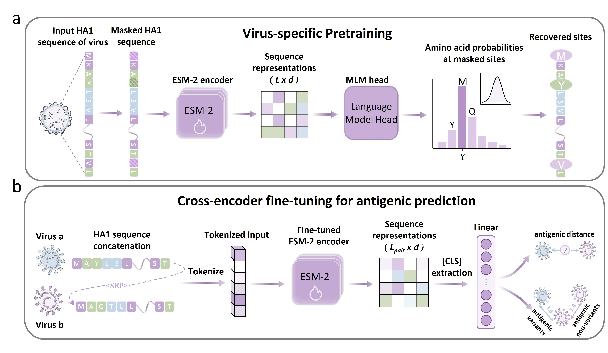

# VirPLM
## description
VirPLM is a two-stage framework that leverages the fine-tuned ESM-2 protein language model on H3N2 HA1 sequences for accurate antigenic prediction.
 

## Getting Started
### dependencies
- Torch 1.11.0
- Transformers 4.47.1
- Tokenizers 0.21.0
- Huggingface Hub
- Numpy 1.26.4
- Pandas 2.2.3
- Scipy 1.14.1
- Matplotlib 3.10.0

Data preprocessing dependencies:

- Pandas
- Numpy
- Openpyxl
- Joblib
- Tqdm
- Loguru
- Unidecode

### How to run
If you want to manually setup VirPLM, we recommend you to use Anaconda to build the runtime environment. The ESM-2 setup is based on the [official ESM repository](https://github.com/facebookresearch/esm).

#### Step 1: Clone this repository from Github.
```bash
git clone https://github.com/xingyili/VirPLM.git
cd VirPLM
```

#### Step 2: Preprocess the dataset.
Run the preprocessing pipeline from the project root:

```bash
bash data_preprocess/run_pipeline.sh
```

#### Step 3: Pretrain ESM-2 on the HA1 sequence set.
```bash
python main.py --mode pretrain --config configs/default.yaml \
  --fasta-paths data_preprocess/tmp/H3N2.fasta \
  --output-dir H3pre_model
```
#### Step 4: Fine-tune with cross-validation

```bash
python main.py --mode cv \
  --config configs/default.yaml \
  --pretrained-model-dir H3pre_model \
  --ha-path data_preprocess/tmp/H3N2_NHT_HA.csv \
  --hi-path data_preprocess/tmp/H3N2_NHT_HI.csv
```
#### Step 5: Run retrospective time-split evaluation

Retrospective evaluation requires exact virus collection dates and independently pretrained models for each evaluation window.

The metadata CSV must contain the following columns:

```text
header
Collection_Date
```

```bash
python main.py \
  --mode backtest \
  --config configs/default.yaml \
  --ha-path data_preprocess/tmp/H3N2_NHT_HA.csv \
  --hi-path data_preprocess/tmp/H3N2_NHT_HI.csv 
```

You can customize the execution by modifying `configs/default.yaml` or command-line arguments.
